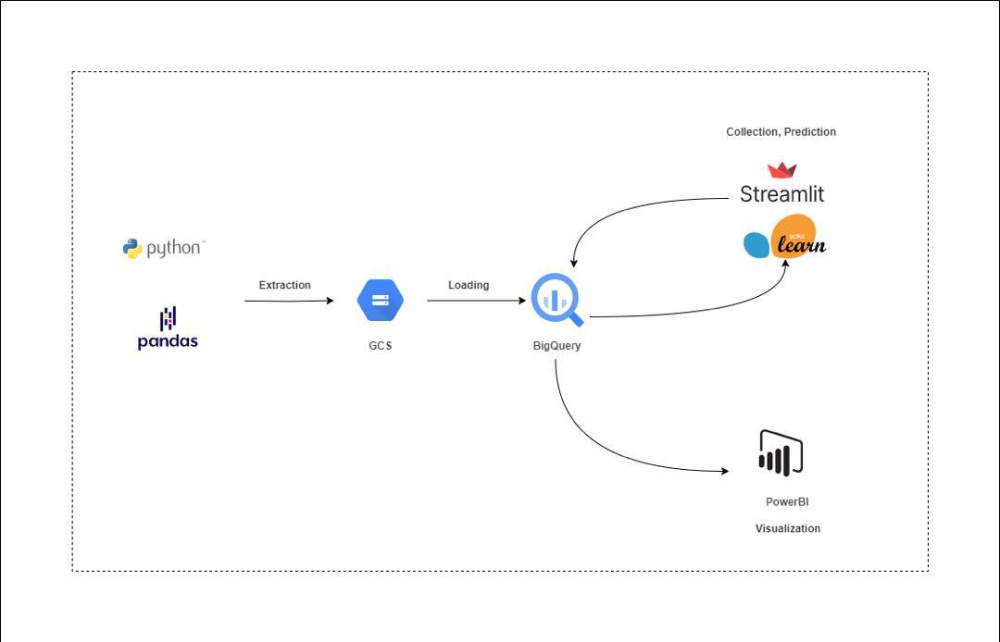

# AgriLift: Improving Access to Affordable Finance for Young Agripreneurs in Nigeria 🌾💰

### 🌱 Project Background
We were tasked with developing a **data-driven solution** that identifies **creditworthy young farmers** in Nigeria, predicts **loan repayment behavior**, and fosters trust between **agripreneurs and financiers**. Our end-to-end solution features data simulation, warehousing, machine learning, and a user-friendly web interface to enhance access to affordable financing for youth-led agricultural enterprises.

## 🚀 LIVE PROJECT

- View the Live Web App [here](https://team-rushhour.streamlit.app/)
- View the Analytics Dashboard [here](https://app.powerbi.com/view?r=eyJrIjoiY2NlYmIxN2ItMmRlYS00YzZjLWIxZWYtZTYxMGMzNzJhNzQ0IiwidCI6IjhkNzA3ZDY0LTgwNWYtNDM3OS1hOWQxLWU1M2VlNjE3YzBkYiJ9)
- View the Prototype App [here](https://www.figma.com/proto/vxUYmhgnXhS86z1Xllr8X0/Agrolift?page-id=1%3A2&node-id=4-1427&starting-point-node-id=4%3A1427&scaling=scale-down-width&content-scaling=fixed&t=KLhy1l7N9h82iPKV-1)

## 📦 Project Structure

### 1. `scripts/` – Data Simulation Scripts
Contains Python script for generating synthetic but realistic data reflecting the Nigerian agribusiness landscape:
- `mock_agriculture_data_generator2.py`: Creates demographic profiles of 3,000 young farmers, simulates farm size and other farm details, as well as farmer loan records

### 2. `datasets/` – Synthetic CSV Datasets
Houses all generated CSV datasets used for exploration, modeling, and analysis:
- `dim_farmer.csv`: contains demographic profiles of 3,000 young farmers.
- `dim_farm.csv`: contains farm size, location, irrigation type, and market access.
- `dim_financial_history.csv`: contains banking status, past loan records, and credit behavior.

### 3. `web app/` – Streamlit Web Application
houses the scripts used to develop the simple interface for interacting with the model and data.

---

## 🔍 Problem Statement
Youth agripreneurs in Nigeria often lack the credit history and documentation that traditional financiers require, limiting their access to affordable capital. Our solution uses **alternative data points** (demographics, farm details, digital literacy, and financial behavior) to model **creditworthiness** and **reduce financing risk**.

## 🔧 Process & Architecture

### 1. Data Generation
- Synthetic datasets were generated to simulate realistic profiles of young Nigerian farmers.
- Data fields were designed to reflect practical variables such as education level, digital skills, and pest incidence.

### 2. Data Modeling
- Built a **star schema**-based data warehouse consisting of:
  - `dim_farmer`: Farmer demographic profile
  - `dim_farm`: Farm characteristics and conditions
  - `dim_financial_history`: Credit behavior and loan history

### 3. Machine Learning
- Built a classifier model to predict loan success or repayment probability.
- Training involved labeled data with both successful and defaulted loans.
- Model inputs include digital literacy, years in farming, soil quality, and previous loan behavior.

### 4. Web App Deployment
- Users (e.g., microfinance officers) can enter a new farmer’s information and get instant feedback on their loan eligibility or projected repayment behavior.

## 📊 Key Insights
- Farmers with **tertiary education, good soil, and training access** showed higher likelihood of repayment.
- **Digital literacy** strongly correlates with access to financial services.
- **Belonging to a cooperative** improves chances of getting financing and repaying on time.

## 💡 Recommendations
- Encourage agribusiness training programs for young farmers.
- Incentivize digital financial inclusion via mobile banking and education.
- Design credit scoring models that go beyond traditional financial history.

📈 Deliverables
- Synthetic Datasets: Clean, labeled data for 3,000 Nigerian youth farmers
- Data Warehouse Schem:	Structured star schema for easy querying and analysis
- Machine Learning Model:	Predicts loan repayment probability using alternative data
- Streamlit Web App:	Simple interface for financiers and policymakers
- Data Visualization: Built a three-page interactive dashboard that highlights farmers finance profile in detail
- Figma Prototype: Clickable UI/UX prototype of the solution

🤝 Team Members
- Joy Ibe
- Aminat Olatunji
- Kenneth Essien
- Adewunmi
- Ayomide
