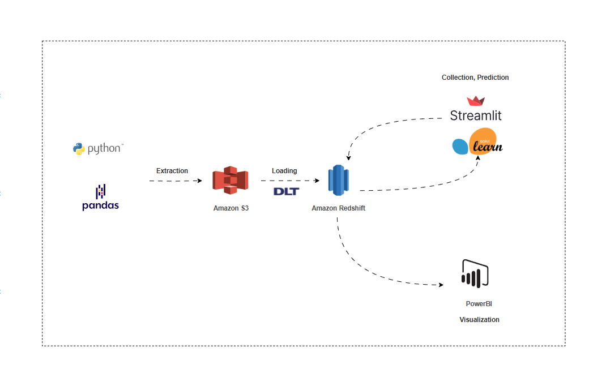

# AgroLift: Improving Access to Affordable Finance for Young Agripreneurs in Nigeria 🌾💰

### 🌱 Project Background
We were tasked with developing a **data-driven solution** that identifies **creditworthy young farmers** in Nigeria, predicts **loan repayment behavior**, and fosters trust between **agripreneurs and financiers**. Our end-to-end solution features data simulation, warehousing, machine learning, and a user-friendly web interface to enhance access to affordable financing for youth-led agricultural enterprises

## 🚀 LIVE PROJECT

- View the Live Web App [here](https://team-rushhour.streamlit.app/)
- View the Analytics Dashboard [here](https://app.powerbi.com/view?r=eyJrIjoiY2NlYmIxN2ItMmRlYS00YzZjLWIxZWYtZTYxMGMzNzJhNzQ0IiwidCI6IjhkNzA3ZDY0LTgwNWYtNDM3OS1hOWQxLWU1M2VlNjE3YzBkYiJ9)
- See the App Prototype [here](https://www.figma.com/proto/vxUYmhgnXhS86z1Xllr8X0/Agrolift?page-id=1%3A2&node-id=4-1427&starting-point-node-id=4%3A1427&scaling=scale-down-width&content-scaling=fixed&t=KLhy1l7N9h82iPKV-1)
  - See an explanation of the prototype and user flow in this video [here](https://drive.google.com/file/d/1EPz3CU0YSPuKzaqWCH-fojtCulmEXX9k/view?usp=sharing)

#### Key App Features:
- `Farmer Education Hub`: This feature provides young farmers with bite-sized, localized learning modules on. How to improve creditworthiness. Best practices in recordkeeping, budgeting, and digital finance. By improving financial and agricultural literacy, this hub empowers farmers to become more bankable — directly addressing the brief’s call for farmer education tools that build trust with financiers.
- `Farmer Groups`: This module allows users to join or form cooperatives, enabling group-based lending, peer accountability, and resource sharing.
- `Partner with Agribusiness Training Centers`: We simulate a network of training organizations that can validate, mentor, or certify young farmers. Farmers can link their profiles to completed training or certifications. Verified training improves trust signals for lenders evaluating applications.

## 📦 Project Structure

### 1. `scripts/` – Data Simulation Scripts
Contains Python script for generating synthetic but realistic data reflecting the Nigerian agribusiness landscape:
- `mock_agriculture_data_generator2.py`: Creates demographic profiles of 3,000 young farmers, simulates farm size and other farm details, as well as farmer loan records

### 2. `datasets/` – Synthetic CSV Datasets
Houses all generated CSV datasets used for exploration, modeling, and analysis:
- `dim_farmer.csv`: contains demographic profiles of 3,000 young farmers
- `dim_farm.csv`: contains farm size, location, irrigation type, and market access
- `dim_financial_history.csv`: contains banking status, past loan records, and credit behavior

### 3. `web app/` – Streamlit Web Application
houses the scripts used to develop the simple interface for interacting with the model and data

---

## 🔍 Problem Statement
Youth agripreneurs in Nigeria often lack the credit history and documentation that traditional financiers require, limiting their access to affordable capital. Our solution uses **alternative data points** (demographics, farm details, digital literacy, and financial behavior) to model **creditworthiness** and **reduce financing risk**

## 🔧 Process & Architecture

### 1. Data Generation
- Synthetic datasets were generated to simulate realistic profiles of young Nigerian farmers
- Data fields were designed to reflect practical variables such as education level, digital skills, and pest incidence

### 2. Data Modeling
- Built a **star schema**-based data warehouse consisting of:
  - `dim_farmer`: Farmer demographic profile
  - `dim_farm`: Farm characteristics and conditions
  - `dim_financial_history`: Credit behavior and loan history

### 3. Data Analytics
   - Performed exploratory data analysis to identify patterns in loan access and repayment.  
   - Generated visualizations showing relationships between digital skills, farming experience, and credit outcomes.  
   - Identified key features most associated with successful loan repayment using correlation matrices and feature importance ranking.

### 4. Machine Learning
- Built a classifier model to predict loan success or repayment probability
- Training involved labeled data with both successful and defaulted loans
- Model inputs include digital literacy, years in farming, soil quality, and previous loan behavior

### 5. Web App Deployment
- Farmers have a web interface via which they can request a loan
- Lenders / Microfinance officers can enter a new farmer’s information and get instant feedback on their loan eligibility or projected repayment behavior; using this to decide whether to accept or reject the loans

## 📊 Key Insights
- Farmers with good soil and training access showed a higher likelihood of repayment.
- Digital literacy strongly correlates with access to financial services.
- Lower-medium scale farms predominate, with fewer smallholder and upper-medium scale operations. This shows that most farmers operate on a small scale.
- High activity areas suggest the likelihood of loan repayment.
- Farmers who mostly need loans for Irrigation and land expansion purposes are most likely to repay their loans.

## 💡 Recommendations
- Encourage agribusiness training programs for young farmers
- Incentivize digital financial inclusion via mobile banking and education
- Design credit scoring models that go beyond traditional financial history

📈 Deliverables
- Synthetic Datasets: Clean, labeled data for 3,000 Nigerian youth farmers
- Data Warehouse Schema:	Structured star schema for easy querying and analysis
- Machine Learning Model:	Predicts loan repayment probability using alternative data
- Streamlit Web App:	Simple interface for financiers and policymakers
- Data Visualization: Built a three-page interactive dashboard that highlights farmer's finance profile in detail
- Figma Prototype: Clickable UI/UX prototype of the solution

🤝 Team Members
- Joy Ibe
- Aminat Olatunji
- Kenneth Essien
- Adewunmi
- Ayomide
